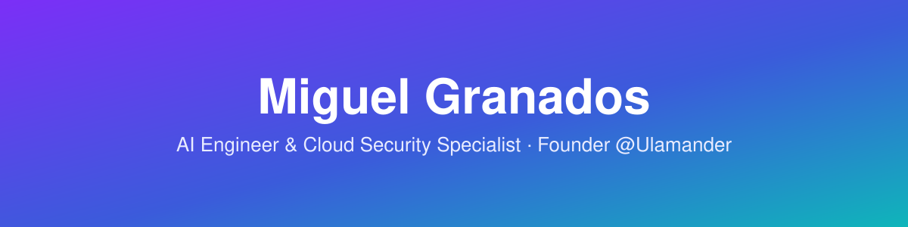

### 👋 Hi, I'm Miguel — AI Engineer & Cloud Security Specialist

---

## 👤 About Me

Founder of **Ulamander** — I work on applied AI and cloud security, focused on
threat detection, automation, and local-first / privacy-first tooling.

- 🔭 **Currently focused on:** Microsoft Sentinel, Defender XDR, GitHub Advanced Security
- 🛡️ **Security:** Fortinet NSE 3 (working toward NSE 4)
- 🤖 **AI Engineering:** local-first apps, automation, AI-driven matching
- 📍 Turin, Italy

---

## 🛠️ Tech Stack

---

## 📊 GitHub Stats

---

## 🎯 Certification roadmap (2026)

Real certifications relevant to my Sentinel / Defender / Fortinet / GHAS work.
None are claimed as already earned here unless actually passed.

| Certification | Focus | Official link |
|---|---|---|
| **SC-200** — Security Operations Analyst Associate | Microsoft Sentinel + Defender XDR | [Microsoft Learn](https://learn.microsoft.com/en-us/credentials/certifications/security-operations-analyst/) |
| **AZ-500** — Azure Security Engineer Associate | Azure infrastructure security | [Microsoft Learn](https://learn.microsoft.com/en-us/credentials/certifications/azure-security-engineer/) |
| **AI-102** — Azure AI Engineer Associate | Enterprise AI solutions on Azure | [Microsoft Learn](https://learn.microsoft.com/en-us/credentials/certifications/azure-ai-engineer/) |
| **Fortinet NSE 4** | Network Security Professional (next step after NSE 3) | [Fortinet Training](https://www.fortinet.com/training-certification) |
| **GitHub Advanced Security** | CodeQL, secret scanning, repo protection | [GitHub Certifications](https://docs.github.com/en/get-started/showcase-your-expertise-with-github-certifications/about-github-certifications) |
| **CCSP** — Certified Cloud Security Professional | Cloud security (ISC)² | [(ISC)² CCSP](https://www.isc2.org/certifications/ccsp) |

**📚 Microsoft Learn progress:** Level 15 · 773K+ XP · 8 learning paths completed across security,
Entra, cloud, and M365 fundamentals — no certification exam passed yet, that's the next real step.
[Public transcript ↗](https://learn.microsoft.com/en-us/users/miguelvictorgranadosmasias-2225/)

---

## 🏆 GitHub Achievements

*Earned badges — live from GitHub's own achievement icons, updated as new ones unlock.*

GitHub's profile badges unlock **only through real activity** on the platform — they can't be
added manually. Here's what earns each one, and their tiers:

| Achievement | How to earn it | Tiers (base → gold) |
|---|---|---|
| 🦈 **Pull Shark** | Open pull requests that get merged | 2 / 16 / 128 / 1024 |
| ⚡ **Quickdraw** ✅ | Close an issue or PR within 5 minutes of opening it | one-time |
| 🎲 **YOLO** ✅ | Merge a PR without review — even on your own repo | one-time |
| 🧠 **Galaxy Brain** | Get accepted answers in GitHub Discussions | 2 / 8 / 16 / 32 |
| 🤝 **Pair Extraordinaire** | Co-author a merged commit with another real GitHub account | 1 / 10 / 24 / 48 |
| ⭐ **Starstruck** | Own a repo that earns real stars from other people | 16 / 128 / 512 / 4096 |
| ❤️ **Public Sponsor** | Sponsor a real contributor/project via GitHub Sponsors | one-time |

Pull Shark isn't showing yet even with 2 merged PRs — GitHub's badge calculation has a processing
delay, not an error. Starstruck and Public Sponsor require genuine outside activity (real people
starring a repo, an actual sponsorship) that can't be faked here.

Live status: [github.com/MiguelGranado](https://github.com/MiguelGranado) → Achievements tab.

---

💬 **Open to consulting, collaborations, and interesting problems in AI + security.**

**Miguel Granados** · Founder of [Ulamander](https://ulamander.com)

